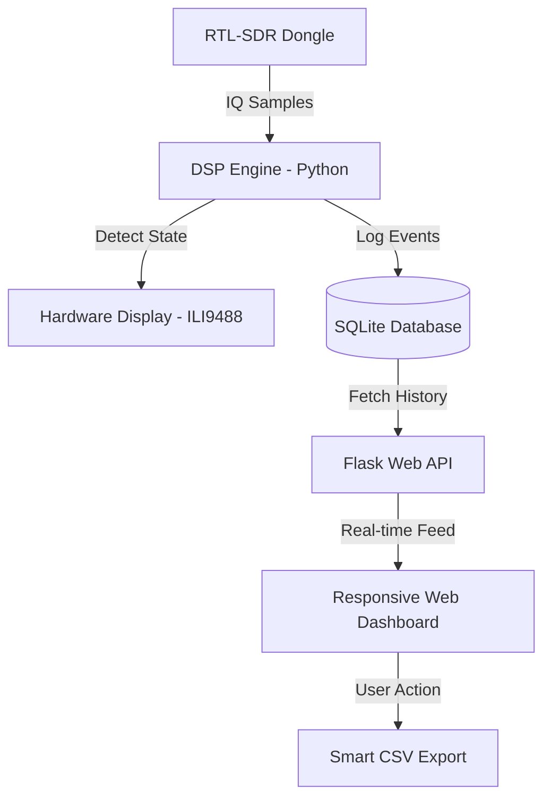
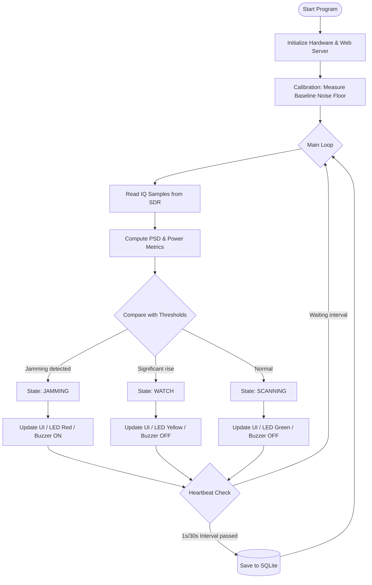

# 🛰️ GNSS L1 Jamming Detector Handheld V1.0


**[TH]** ระบบตรวจจับและบันทึกสัญญาณรบกวน GNSS อัจฉริยะ ออกแบบมาเพื่อการใช้งานภาคสนามโดยเฉพาะ  
**[EN]** Advanced GNSS Jamming Detection & Logging system, engineered for field intelligence and signal security.

---

## 📸 Web Dashboard Overview


---

## 🏗️ System Architecture

The software and hardware architecture is designed to handle continuous digital signal processing alongside real-time user interface rendering on a constrained edge device.

### High-Level Data Flow


### State Machine Logic


---

## 📦 Bill of Materials (BOM)

| Component | Description / Spec | Purpose |
| :--- | :--- | :--- |
| **Raspberry Pi Zero 2W** | Quad-core 64-bit ARM Cortex-A53, 512MB RAM | Core processing unit |
| **RTL-SDR V3** | RTL2832U ADC, 500 kHz – 1766 MHz | RF Signal Receiver |
| **ILI9488 LCD Display** | 3.5" TFT SPI 480x320 with Touch (XPT2046) | Field User Interface |
| **MPU6050 (IMU)** | 6-DoF Accelerometer & Gyroscope (I2C address: `0x69`) | Directional tracking for Polar Radar (Search Mode) |
| **DS3231 (RTC)** | Precise I2C Real-Time Clock (I2C address: `0x68`) | Precise timekeeping for offline database logging in the field |
| **LX-28UPS Module** | UPS/Power Management Board | Charging & 5V Boost Converter |
| **18650 Batteries** | 2x Lithium-ion Cells | Portable power source |
| **Directional Antenna** | Optimized for GNSS L1 (1575.42 MHz) | Directional signal capture |
| **Peripherals** | RGB LEDs, Active Buzzer, Mute Switch | Alert outputs and hardware mute switch control |

---

## 📂 File Structure

```text
.
├── hardware/
│   ├── mpu6050.py          # I2C driver for MPU6050 Accelerometer/Gyroscope
│   └── rtc_ds3231.py       # I2C driver for DS3231 Real-Time Clock
├── web/
│   ├── index.html          # Web Dashboard UI (Glassmorphism minimalist)
│   ├── style.css           # Dashboard Styling & Responsive Layout
│   └── script.js           # Frontend Logic, Day/Night Theme, Polling & Render Control
├── buzzer.py               # Audio Alert Controller (GPIO 18)
├── config.py               # System Configurations & Pin Definitions
├── database_manager.py     # SQLite Handler & Smart Heartbeat Filter
├── detector.py             # Core Signal Processing, State Machine, & Soft Power Logic
├── display_ui.py           # LCD Display Driver, Rendering Modes, & Confirmation Dialog
├── dsp.py                  # DSP Utilities (FFT & Power Calculation)
├── led_control.py          # Visual Status Indicators (RGB LEDs)
├── main.py                 # Application Entry Point
├── test_sensors.py         # Hardware Sensor Test Utility (IMU and RTC)
├── requirements.txt        # Python Dependencies List
└── README.md               # Project Documentation
```

---

## 🌟 Key Technical Highlights
- **Field-Optimized UI:** High-visibility UI designed for outdoor use, featuring clear State Badges and critical metrics.
- **Interactive Calibration:** On-the-fly calibration selection (**Auto NF** vs. **Fixed NF**) to ensure precision in varied RF environments.
- **Polar Radar (Search Mode):** Visual compass utilizing IMU data (MPU6050) to map signal strength directivity, aiding in identifying jammer locations.
- **Offline RTC Synchronization:** Utilizes the DS3231 I2C RTC sensor to automatically restore and synchronize the Raspberry Pi system time on boot, ensuring accurate logging timestamps in offline field operations.
- **In-Process Software Restart:** Fast 2-second in-place application reload (via `os.execv`) to instantly reset MPU6050 and system I2C/SPI interfaces from the LCD without waiting for a full OS reboot.
- **Safe Shutdown Sequence:** Prevents SD card corruption via a robust 5-second splash screen sequence and synchronous system halt fallbacks before power-off.
- **Optimized Day/Night Web UI:** Ultra-smooth Glassmorphism minimalist web dashboard with Day/Night Theme toggling ☀️🌙. Engineered for low CPU overhead on Raspberry Pi using **Event-Driven rendering** (draws canvases only when new RF data arrives at 4Hz/2Hz) and **DOM Value Differencing** to eliminate forced layout reflows.
- **Buzzer Mute Versatility:** Replaced unreliable touchscreen controls with support for an external physical solder-on button (GPIO 23) for robust audio silencing in the field.
- **Adaptive Signal Analysis:** Real-time Noise Floor and Peak Power calculations coupled with Adaptive Thresholding and SNR metrics.
- **Adaptive Heartbeat Logging:** Smart SQLite logging frequency (1s during events, 30s during idle) to optimize storage capacity, prevent write exhaustion, and reduce MicroSD I/O strain.

---

## 🚀 Installation & Deployment

1. **Prepare OS:** Install Raspberry Pi OS (64-bit Lite/Desktop).
2. **Setup Code:**
   ```bash
   git clone https://github.com/User/Jamming-Detector-Handheld.git
   cd Jamming-Detector-Handheld
   pip install -r requirements.txt
   ```
3. **Configure Hotspot:** Use `nmcli` to set up an auto-starting WiFi Hotspot (e.g., SSID: `Jamming-Detector-Handheld`).
4. **Auto-Start:** Create and enable a systemd service (`jamming.service`) to execute `main.py` on boot.

---

## 🛣️ Roadmap
- [x] **Compass Integration:** Add Polar Radar Mode to locate signal sources.
- [x] **Interactive Gain Control:** Enable on-the-fly RF gain adjustment via touch interface.
- [ ] **GPS Module Integration:** Plot jamming locations on real-time maps.
- [ ] **Offline Map Tiles:** Enable dashboard mapping in remote/offline environments.

---

## 👨‍💻 Developer
**67010655 Mr.Peerayoot Wattananualsakul**  
*Space and Geospatial Engineering, KMITL*  
*Building tools for the future of satellite security.*

---

## 🎨 3D Designer
**67010281 Ms.Nattakan Sanorlam**  
*Space and Geospatial Engineering, KMITL*  
*Designing the future of satellite security.*

---
© 2026 Jamming Detector Project. Built with ❤️ and Python.
