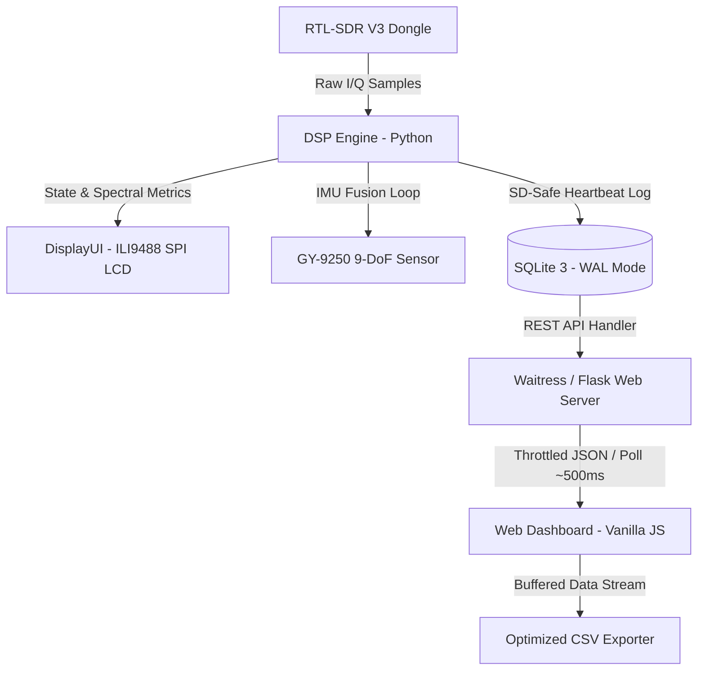
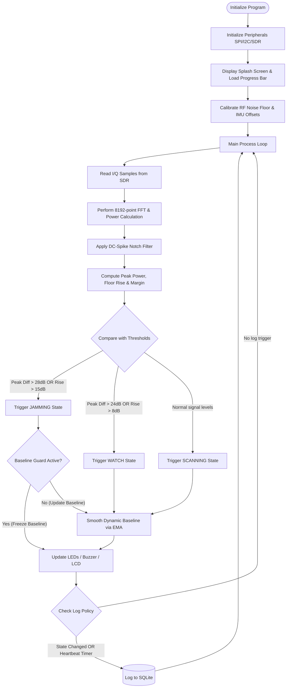
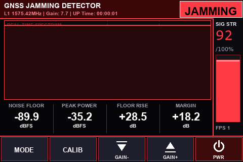
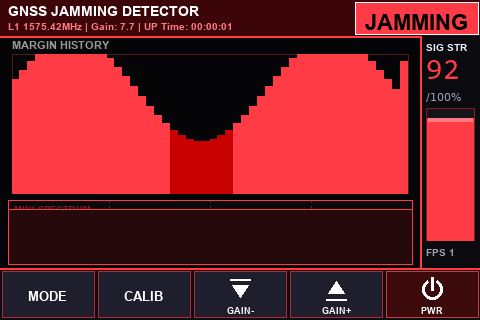

# GUNJAM — GNSS L1 Jamming Detector Handheld

**กันแจม** · _Jamming Detector Handheld_ · Version 1.0 (2026)


---

## 📡 Executive Summary & Project Overview

**GUNJAM (กันแจม)** is a field-ready, portable GNSS jamming detection and analysis system designed for the GPS L1 frequency band (1575.42 MHz). Developed as an engineering capstone project under the **Telecommunication Engineering Department, King Mongkut's Institute of Technology Ladkrabang (KMITL)**, and supported by **NBTC** and **BTFP**, this device provides telecommunication engineers and radio regulatory officers with a real-time, pocket-sized tool to identify, log, and locate illegal GNSS jamming signals in the field.

The system utilizes an **RTL-SDR V3** software-defined radio front-end driven by a custom **Python DSP pipeline** running on a **Raspberry Pi Zero 2W**. It features an on-device **3.5" ILI9488 TFT LCD touch interface** for real-time monitoring and direction finding (via sensor fusion), and hosts an asynchronous **Waitress WSGI / Flask web server** serving a premium, low-overhead responsive web dashboard over a local Wi-Fi access point.

---

## 🛠️ System Architecture & Engineering Design

The project is architected with a strict separation of concerns to maintain deterministic performance on resource-constrained hardware (Raspberry Pi Zero 2W). Heavy digital signal processing (DSP) and hardware interaction loops run in a high-priority Python thread, while a separate server process hosts the REST API, minimizing latency on both the local SPI display and client browsers.

### High-Level System Data Flow



### Jamming Detection State Machine & Hysteresis Logic



---

## ⚡ Engineering & DSP Implementations

### 1. Digital Signal Processing (DSP) & Detection Algorithm
* **Fourier Analysis**: The system captures raw time-domain complex $I/Q$ samples at a sample rate of $f_s = 1.024\text{ MSPS}$ centered at $f_c = 1575.42\text{ MHz}$. It performs an $N$-point Fast Fourier Transform (FFT) with $N=8192$ utilizing a **Hanning window** to reduce spectral leakage.
* **DC Spike Removal**: Standard RTL-SDRs exhibit a strong central DC offset spike. The DSP pipeline applies a notch filter by zeroing out the central 10 bins ($DC \pm 5$ bins) and interpolating the adjacent bin powers to restore signal integrity.
* **Adaptive Baseline & Dynamic Guard Lock**: 
  * In `SCANNING` and `WATCH` states, the noise floor ($N_f$) is dynamically smoothed using an Exponential Moving Average (EMA) filter:
    $$N_{f}[t] = \alpha \cdot N_{f}[t-1] + (1 - \alpha) \cdot N_{\text{current}}$$
    Where $\alpha_{\text{idle}} = 0.97$ and $\alpha_{\text{alert}} = 0.998$ to prevent slow alert drift.
  * When a massive power increase is detected ($N_{\text{current}} > N_{f} + 8\text{ dB}$), the **Baseline Guard** locks the dynamic update process. This prevents the jammer from dragging the noise floor baseline upward, which would otherwise "blind" the detector and clear the alarm.

### 2. Sensor Fusion & Compass Alignment (GY-9250 IMU)
* **Vertical Mount Kinematics**: Because the handheld enclosure is mounted vertically, the chip's Y-axis is vertical and discarded. Heading calculation is restricted to the horizontal $X$ and $Z$ magnetic axes.
* **Complementary Filter Algorithm**: To combine the fast response of the gyroscope with the absolute reference of the magnetometer, a 9-axis complementary filter is used to calculate device bearing:
  $$\theta[t] = \alpha_{\text{fusion}} \cdot (\theta[t-1] + \omega_z \cdot dt) + (1 - \alpha_{\text{fusion}}) \cdot \theta_{\text{mag}}$$
  Where $\alpha_{\text{fusion}} = 0.95$, mitigating high-frequency gyro drift and low-frequency magnetic noise.
* **Compass Vector Alignment**: The magnetic compass needle UI points to North ($0^\circ$). The internal coordinates are mapped using standard polar coordinate transformations rotated by $-90^\circ$ to align with the screen's Y-axis (top of screen = facing direction).

### 3. Flash Memory & Database Life Optimization
* **SQLite Write Buffering**: Constant database writes wear down MicroSD cards. The logger implements a strict heartbeat logging policy:
  * **Immediate Log** on state changes (e.g., `SCANNING` $\rightarrow$ `JAMMING`).
  * **30-second heartbeat** during quiet `SCANNING` states.
  * **3-second heartbeat** during active `WATCH` or `JAMMING` states.
* **Database Pruning**: An automated garbage collection query runs on every write, keeping only the latest $1,000$ non-startup records to prevent database bloating.

### 4. High-Performance Front-end Dashboard
* **Event-Driven Canvas Drawing**: Instead of drawing at 60 FPS in a resource-heavy animation loop, rendering (Spectrum, Waterfall, Radar) is strictly throttled and triggered only when new JSON payload packets arrive from `/api/status` (4 Hz).
* **Bandwidth Downsampling**: Transmitting a raw 8192-bin FFT payload over the local Wi-Fi hotspot saturates the Pi Zero 2W's network buffer. The server resamples and downsamples the power spectrum to a clean 240-point array before transmission.

---

## 🎛️ Handheld TFT LCD UI Showcase

The 3.5" TFT SPI Display ($480 \times 320$ resolution) features three custom screen modes optimized for field operations:

| 1. NORMAL MODE (Real-time Spectrum) | 2. SEARCH MODE (Gyro Compass & Radar) | 3. ANALYTICS MODE (Margin History) |
| :---: | :---: | :---: |
|  |  |  |
| Displays real-time FFT spectrum, dynamic noise floor, peak power level, floor rise, and margin readout. | Displays a rotating compass ring, active search radar, and saves direction vectors of detected jamming events. | Displays a 50-frame historical bar chart of the threat margin, coupled with a mini spectrum preview. |

---

## 🖥️ Web Dashboard Overview

The web dashboard is accessed by connecting to the device's local Wi-Fi hotspot:


* **Modern Aesthetics**: Curated dark/light themes featuring an HSL tailored color palette, glassmorphism card containers, and dynamic interactive particle backgrounds.
* **Real-time Visualization**: Real-time canvas-based RF spectrum, waterfall spectrogram, and signal margin trends.
* **Historical Auditing**: SQLite data retrieval with date-time filtering, instant database clearing, and automated local CSV exports.

---

## 🔌 Hardware Schematics & I2C Address Mapping

The system shares the **I2C1** bus on the Raspberry Pi Zero 2W between the DS3231 RTC and the GY-9250 IMU.

```
                    Raspberry Pi Zero 2W (I2C1 Bus)
                              │          │
                     ┌────────┴────────┐ └────────┬────────┐
                     │                 │          │        │
                   [SDA]             [SCL]      [3.3V]   [GND]
                     │                 │          │        │
           ┌─────────┴─────────┐       ├──────────┼────────┼─────────┐
           │   DS3231 RTC      │       │          │        │         │
           │   (Address: 0x68) │       │   ┌──────┴────────┴──────┐  │
           └───────────────────┘       │   │     GY-9250 IMU      │  │
                                       │   │   (Address: 0x69)    │  │
                                       │   │                      │  │
                                       │   │   * AD0/ADO Pin ────┐│  │
                                       │   └───┬─────────────────┼┘  │
                                       │       └─────────────────┘   │
                                       └─────────────────────────────┘
```

> [!CAUTION]
> **I2C Address Collision Prevention**: The DS3231 RTC occupies address `0x68`. The GY-9250 IMU defaults to address `0x68` when its AD0/ADO pin is LOW or floating. You **must** connect the **AD0/ADO pin on the GY-9250 directly to 3.3V** to force its address to `0x69` before booting the device. Do **not** feed 5V into the AD0/ADO pin.

For detailed hardware connections and SPI pin configurations, see the [HARDWARE_WIRING.md](file:///d:/Documents/GitHub/Jamming-Detector-Handheld/HARDWARE_WIRING.md) guide.

---

## 📁 Project Directory Structure

```text
.
├── hardware/
│   ├── imu.py                  # IMU class factory & model selector
│   ├── mpu9250.py              # GY-9250 9-DoF IMU sensor driver & calibration
│   └── rtc_ds3231.py           # DS3231 Real-Time Clock I2C driver
├── web/
│   ├── index.html              # Web Dashboard layout
│   ├── style.css               # Day/Night themes, animations, glassmorphism styles
│   ├── script.js               # Event-driven canvas renderer & AJAX API polling
│   └── *.png                   # Sponsor logos & asset resources
├── tests/
│   ├── test_database_manager.py# Connection leak regression tests
│   ├── test_dsp.py             # DSP math & notch filter unit tests
│   └── test_imu_selection.py   # Gyro rotation & fusion complementary tests
├── main.py                     # Application entry point
├── detector.py                 # Core spectrum analyzer loop, baseline guard & state logic
├── display_ui.py               # TFT LCD rendering engine (Normal, Search, Analytics) & touch input
├── dsp.py                      # Welch periodogram power spectral density and DC-spike filter
├── database_manager.py         # SQLite connection pool, log heartbeat logic, & auto-pruner
├── web_server.py               # Waitress WSGI server & Flask REST API
├── config.py                   # Pin mappings, sample rate, thresholds, and IMU calibration values
├── buzzer.py                   # Piezoelectric buzzer PWM controller
├── led_control.py              # RGB status LED controller
├── calibrate_touch.py          # Touch screen calibration coordinates finder
├── test_sensors.py             # Sensor diagnostic harness tool
├── requirements.txt            # Project python dependencies
└── README.md                   # This README file
```

---

## 🚀 Installation & Deployment

1. **Operating System**: Install Raspberry Pi OS Lite (64-bit) on the Pi Zero 2W.
2. **Install Core Dependencies**:
   ```bash
   sudo apt-get update
   sudo apt-get install -y git python3-pip python3-numpy python3-pillow python3-spidev python3-rtlsdr libusb-1.0-0-dev
   ```
3. **Clone the Repository**:
   ```bash
   git clone https://github.com/67010655/Jamming-Detector-Handheld.git
   cd Jamming-Detector-Handheld
   pip install -r requirements.txt --break-system-packages
   ```
4. **Touch Screen Calibration**: Run the touch calibration tool to generate screen matrix coordinates:
   ```bash
   python calibrate_touch.py
   ```
5. **Set Up passwordless Sudo for UI shutdown**: To allow screen controls to shutdown/restart, run:
   ```bash
   sudo visudo /etc/sudoers.d/gunjam
   ```
   Add the following line (replace `pi` with your OS username):
   ```text
   pi ALL=(ALL) NOPASSWD: /sbin/poweroff, /usr/bin/systemctl poweroff, /sbin/shutdown, /sbin/reboot, /usr/bin/systemctl reboot
   ```
6. **Autostart System Service**: Create a systemd service to start Gunjam on boot:
   ```bash
   sudo nano /etc/systemd/system/gunjam.service
   ```
   Paste the following configuration:
   ```ini
   [Unit]
   Description=Gunjam GNSS Jamming Detector
   After=network.target

   [Service]
   WorkingDirectory=/home/pi/Jamming-Detector-Handheld
   ExecStart=/usr/bin/python main.py
   Restart=always
   User=pi

   [Install]
   WantedBy=multi-user.target
   ```
   Enable and start the service:
   ```bash
   sudo systemctl enable gunjam.service
   sudo systemctl start gunjam.service
   ```

---

## 👥 Developers & Collaborators

* **67010655 Mr. Peerayoot Wattananualsakul** — Core Embedded & DSP Software Developer  
  *Telecommunication Engineering Department, KMITL*
* **67010281 Ms. Nattakan Sanorlam** — 3D Enclosure Modeler & Structural Designer  
  *Telecommunication Engineering Department, KMITL*

---

## 📄 License

This project is licensed under the MIT License - see the [LICENSE](LICENSE) file for details.  
© 2026 **King Mongkut's Institute of Technology Ladkrabang (KMITL)**. All rights reserved.
