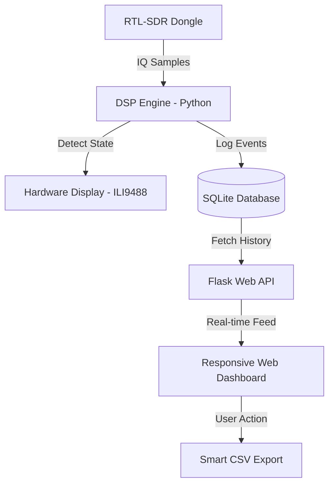
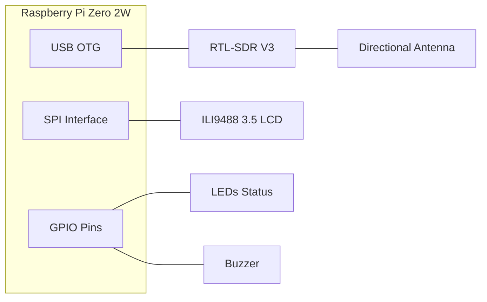

# 🛰️ GNSS L1 Jamming Detector Handheld V1.0


**[TH]** ระบบตรวจจับและบันทึกสัญญาณรบกวน GNSS อัจฉริยะ ออกแบบมาเพื่อการใช้งานภาคสนามโดยเฉพาะ  
**[EN]** Advanced GNSS Jamming Detection & Logging system, engineered for field intelligence and signal security.

---

## Web Dashboard


---

## 🏗️ System Architecture / โครงสร้างระบบ


### ⚙️ Software Logic Flow / ขั้นตอนการทำงานของโปรแกรม


### 🔌 Hardware Interconnect / ผังการเชื่อมต่ออุปกรณ์


---

## 🌟 Key Technical Highlights / ความโดดเด่นทางเทคนิค
- **Field-Optimized UI:** หน้าจอความละเอียดสูงที่ออกแบบมาเพื่อสู้แสงแดดในสนาม พร้อมระบบ State Badge ขนาดใหญ่และพารามิเตอร์ 4 คอลัมน์ที่อ่านง่าย
- **Interactive Calibration:** ระบบเลือกโหมด Calibrate หน้างานได้ทันทีระหว่าง **Auto NF** (ติดตามอัตโนมัติ) หรือ **Fixed NF** (ล็อกค่าคงที่) เพื่อความแม่นยำสูงสุด
- **Polar Radar (Search Mode):** ระบบเข็มทิศเรดาร์ที่ช่วยระบุทิศทางของแหล่งกำเนิดสัญญาณรบกวนตามระดับความเข้มของสัญญาณ (Signal Strength)
- **Safe Shutdown Sequence:** ระบบปิดเครื่องที่ปลอดภัยพร้อมหน้าจอ Splash Screen แจ้งเตือน 5 วินาที เพื่อป้องกันการเสียหายของข้อมูล (SD Card Corruption)
- **Adaptive Signal Analysis:** คำนวณ Noise Floor และ Peak Power แบบเรียลไทม์ พร้อมระบบ Adaptive Thresholding
- **Glassmorphism Web Dashboard:** เข้าถึงข้อมูลเชิงลึกผ่าน WiFi Hotspot ด้วย Dashboard ดีไซน์ทันสมัยแบบ Glassmorphism UI
- **Adaptive Heartbeat Logging:** ระบบบันทึกข้อมูลอัจฉริยะที่ปรับความถี่ตามสถานการณ์ (1s/30s) เพื่อประสิทธิภาพสูงสุดในการจัดเก็บข้อมูล

---

## 📂 Project Structure / โครงสร้างไฟล์
```text
.
├── web/
│   ├── index.html          # Web Dashboard UI (Glassmorphism)
│   ├── style.css           # Dashboard Styling & Responsive Layout
│   └── script.js           # Frontend Logic & Real-time Data Polling
├── buzzer.py               # Audio Alert Controller (GPIO 18)
├── config.py               # System Configurations & Pin Definitions
├── database_manager.py     # SQLite Handler & Smart Heartbeat Filter
├── detector.py             # Core Signal Processing & Jamming Logic
├── display_ui.py           # LCD Display Driver & UI Rendering (ILI9488)
├── dsp.py                  # DSP Utilities (FFT & Power Calculation)
├── led_control.py          # Visual Status Indicators (RGB LEDs)
├── main.py                 # Application Entry Point
├── jamming_events.db       # Local SQLite Database (Auto-generated)
├── requirements.txt        # Python Dependencies List
└── README.md               # Project Documentation
```

---

## 🛠️ Hardware Setup / การต่ออุปกรณ์
- **CPU:** Raspberry Pi Zero 2W
- **SDR:** RTL-SDR V3
- **Display:** 3.5" ILI9488 TFT SPI LCD
- **Peripherals:** 3-Color LEDs, Buzzer

---

## 🚀 Installation & Deployment / การติดตั้ง
1. **Prepare OS:** ติดตั้ง Raspberry Pi OS (64-bit Lite/Desktop)
2. **Setup Code:**
   ```bash
   git clone https://github.com/User/Jamming-Detector-Handheld.git
   cd Jamming-Detector-Handheld
   pip install -r requirements.txt
   ```
3. **Configure Hotspot:** ตั้งค่า `nmcli` เพื่อให้ Pi ปล่อย WiFi อัตโนมัติ (แนะนำ SSID: Jamming-Detector-Handheld)
4. **Auto-Start:** ตั้งค่า `jamming.service` เพื่อให้ระบบรันทันทีที่เปิดเครื่อง

---

## 🛣️ Roadmap / แผนพัฒนาในอนาคต
- [x] **Compass Integration:** เพิ่มหน้าจอเข็มทิศเพื่อระบุทิศทางของแหล่งกำเนิดสัญญาณรบกวน (Polar Radar Mode)
- [x] **Interactive Gain Control:** ระบบปรับ Gain ได้ทันทีผ่านหน้าจอสัมผัส
- [ ] **GPS Module Integration:** แสดงตำแหน่งการตรวจพบลงบนแผนที่ (Map) แบบเรียลไทม์
- [ ] **Offline Map Tiles:** ระบบแผนที่ออฟไลน์บน Dashboard สำหรับการใช้งานในป่าหรือพื้นที่ห่างไกล

---

## 👨‍💻 Developer
67010655 Mr.Peerayoot Wattananualsakul **Space and Geospatial Engineering, KMITL**  
*Building tools for the future of satellite security.*
## 3D Designer
67010281 Mrs.Nattakan Sanorlam **Space and Geospatial Engineering, KMITL**  
*Designing the future of satellite security*
---
© 2026 Jamming Detector Project. Built with ❤️ and Python.
