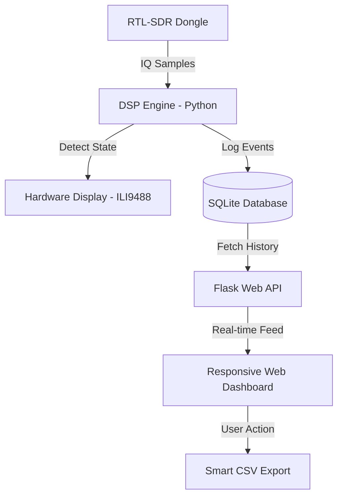
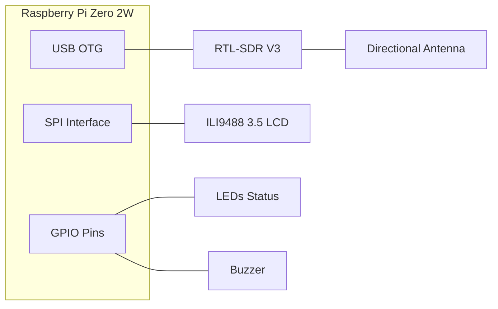

# 🛰️ GNSS L1 Jamming Detector Handheld V1.0


**[TH]** ระบบตรวจจับและบันทึกสัญญาณรบกวน GNSS อัจฉริยะ ออกแบบมาเพื่อการใช้งานภาคสนามโดยเฉพาะ  
**[EN]** Advanced GNSS Jamming Detection & Logging system, engineered for field intelligence and signal security.

---

## 📸 Preview / ตัวอย่างการทำงาน


---

## 🏗️ System Architecture / โครงสร้างระบบ


### ⚙️ Software Logic Flow / ขั้นตอนการทำงานของโปรแกรม


### 🔌 Hardware Interconnect / ผังการเชื่อมต่ออุปกรณ์


---

## 🌟 Key Technical Highlights / ความโดดเด่นทางเทคนิค
- **Multi-Frequency DSP:** ประมวลผลสัญญาณดิจิทัลเพื่อแยกแยะระหว่างสัญญาณปกติและสัญญาณรบกวนได้อย่างแม่นยำ
- **Adaptive Heartbeat Logging:** ระบบบันทึกข้อมูลอัจฉริยะที่ปรับความถี่ตามสถานการณ์ (1s สำหรับเหตุการณ์สำคัญ / 30s สำหรับสถานะปกติ) เพื่อถนอมอายุการใช้งานของ SD Card
- **Seamless Local Hotspot:** เข้าถึงข้อมูลได้ทุกที่ผ่าน WiFi ส่วนตัวของเครื่อง แม้อยู่ในพื้นที่อับสัญญาณอินเทอร์เน็ต
- **Glassmorphism UI:** หน้าจอ Dashboard ดีไซน์ทันสมัย เน้น UX/UI ที่อ่านง่าย สวยงาม และ Responsive

---

## 📂 Project Structure / โครงสร้างไฟล์
```text
.
├── web/
│   ├── index.html          # Web Dashboard UI (Glassmorphism)
│   ├── style.css           # Dashboard Styling & Responsive Layout
│   └── script.js           # Frontend Logic & Real-time Data Polling
├── buzzer.py               # Audio Alert Controller (GPIO 18)
├── config.py               # System Configurations & Pin Definitions
├── database_manager.py     # SQLite Handler & Smart Heartbeat Filter
├── detector.py             # Core Signal Processing & Jamming Logic
├── display_ui.py           # LCD Display Driver & UI Rendering (ILI9488)
├── dsp.py                  # DSP Utilities (FFT & Power Calculation)
├── led_control.py          # Visual Status Indicators (RGB LEDs)
├── main.py                 # Application Entry Point
├── jamming_events.db       # Local SQLite Database (Auto-generated)
├── requirements.txt        # Python Dependencies List
└── README.md               # Project Documentation
```

---

## 🛠️ Hardware Setup / การต่ออุปกรณ์
- **CPU:** Raspberry Pi Zero 2W
- **SDR:** RTL-SDR V3
- **Display:** 3.5" ILI9488 TFT SPI LCD
- **Peripherals:** 3-Color LEDs, Buzzer

---

## 🚀 Installation & Deployment / การติดตั้ง
1. **Prepare OS:** ติดตั้ง Raspberry Pi OS (64-bit Lite/Desktop)
2. **Setup Code:**
   ```bash
   git clone https://github.com/User/Jamming-Detector-Handheld.git
   cd Jamming-Detector-Handheld
   pip install -r requirements.txt
   ```
3. **Configure Hotspot:** ตั้งค่า `nmcli` เพื่อให้ Pi ปล่อย WiFi อัตโนมัติ (แนะนำ SSID: Jamming-Detector-Handheld)
4. **Auto-Start:** ตั้งค่า `jamming.service` เพื่อให้ระบบรันทันทีที่เปิดเครื่อง

---

## 🛣️ Roadmap / แผนพัฒนาในอนาคต
- [ ] **Compass Integration:** เพิ่มหน้าจอเข็มทิศเพื่อระบุทิศทางของแหล่งกำเนิดสัญญาณรบกวน
- [ ] **Rotary Encoder:** ปุ่มปรับ Gain และ Sensitivity แบบหมุนที่ตัวเครื่อง
- [ ] **Map Integration:** แสดงตำแหน่งการตรวจพบลงบนแผนที่เมื่อเชื่อมต่อ GPS Module

---

## 👨‍💻 Developer
67010655 Mr.Peerayoot Wattananualsakul **Space and Geospatial Engineering, KMITL**  
*Building tools for the future of satellite security.*

---
© 2026 Jamming Detector Project. Built with ❤️ and Python.
