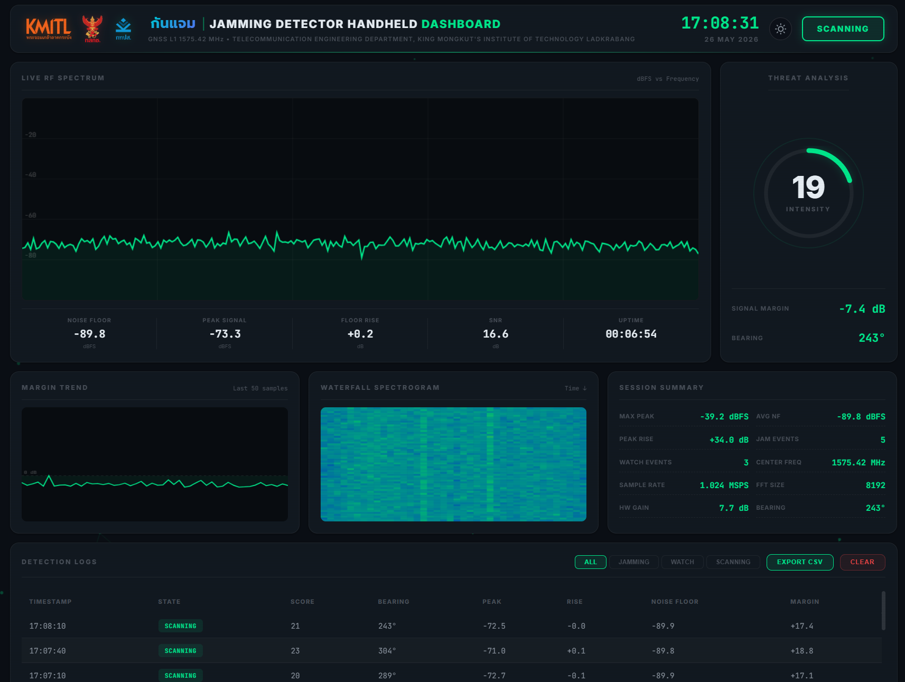
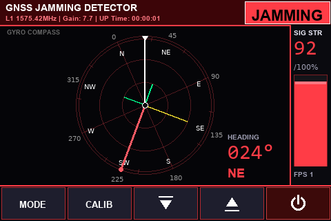
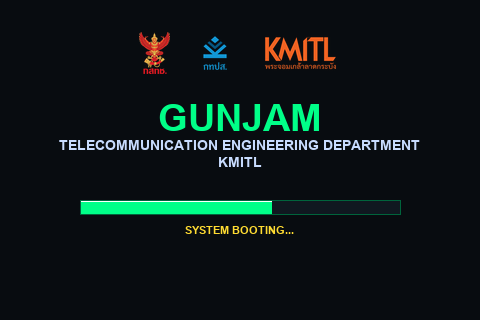
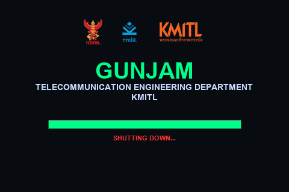
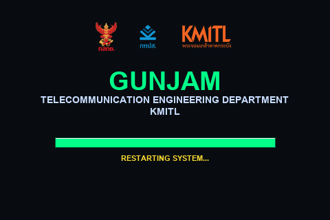
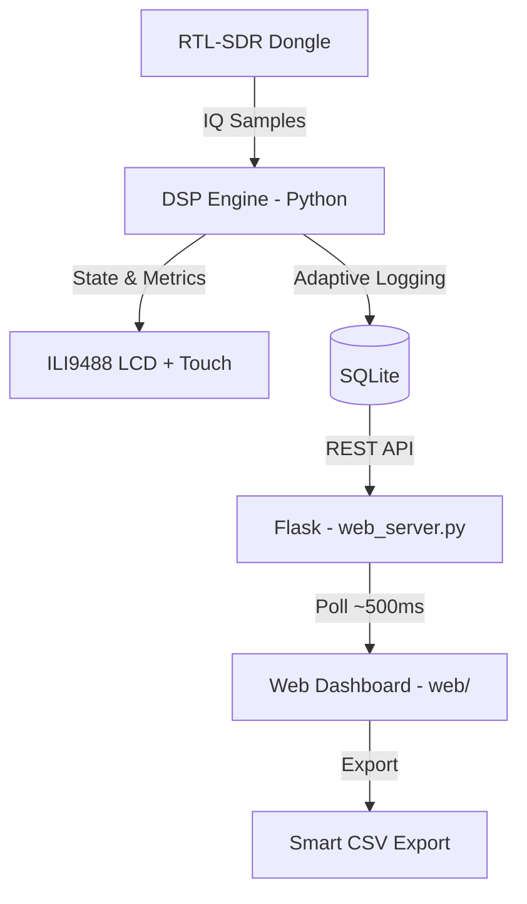
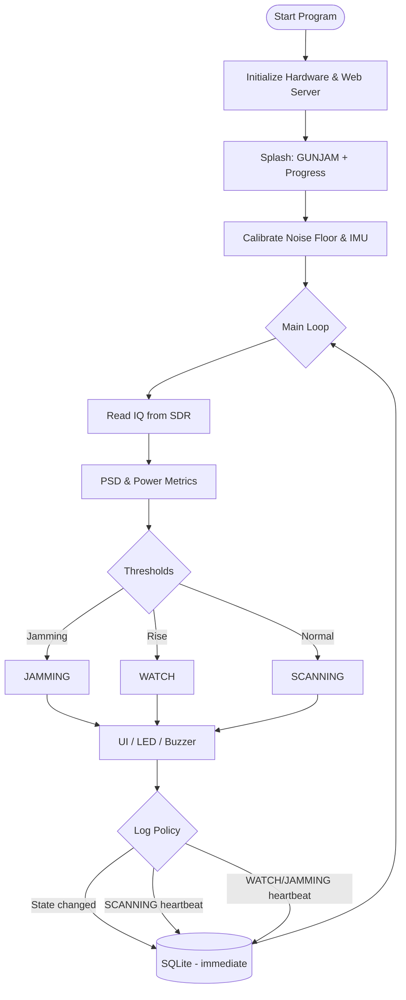

# GUNJAM — GNSS L1 Jamming Detector Handheld

**กันแจม** · _Jamming Detector Handheld_ · Version 1.0 (2026)


**[TH]** ระบบตรวจจับและบันทึกสัญญาณรบกวน GNSS L1 (1575.42 MHz) แบบพกพา ออกแบบสำหรับภาคสนาม พร้อมจอสัมผัสบนเครื่องและแดชบอร์ดเว็บสำหรับวิเคราะห์ข้อมูลย้อนหลัง  
**[EN]** Field-ready GNSS jamming detection and logging on Raspberry Pi Zero 2W — handheld TFT UI, RTL-SDR front-end, and a responsive web dashboard over Wi‑Fi hotspot.

Developed under **Telecommunication Engineering Department, KMITL** with support from project partners (NBTC · BTFP · KMITL).

---

## Branding

| Surface           | Display name              | Notes                                                                        |
| :---------------- | :------------------------ | :--------------------------------------------------------------------------- |
| **LCD splash**    | `GUNJAM`                  | Boot / shutdown splash with partner logos, department line, and progress bar |
| **Web dashboard** | **กันแจม**                | Header title with gradient shimmer and hover / touch scale interaction       |
| **Product**       | Jamming Detector Handheld | GNSS L1 monitoring at 1575.42 MHz                                            |

---

## Web Dashboard Overview



- Glassmorphism dark / light themes with particle background
- Real-time spectrum, margin trend, waterfall, and state-driven accent colours
- Partner logos (KMITL, NBTC, BTFP) in header and footer
- CSV export and event history from SQLite

---

## Handheld LCD UI Showcase (สำหรับนำเสนอระบบ)

ระบบหน้าจอสัมผัสพกพา (Handheld TFT LCD ขนาด 3.5 นิ้ว ความละเอียด 480×320) แสดงผลข้อมูลได้คมชัดสูง ทิศทางการวัดแม่นยำ และมีความลื่นไหลเป็นเลิศ

### 1. โหมดการแสดงผลหลัก (Main UI Modes)

|                              1. NORMAL MODE (Real-time Spectrum)                              |                                  2. SEARCH MODE (Gyro Compass & Radar)                                   |                         3. ANALYTICS MODE (Margin History)                         |
| :-------------------------------------------------------------------------------------------: | :------------------------------------------------------------------------------------------------------: | :--------------------------------------------------------------------------------: |
|                                                |                                                           |                               |
| แสดงผลคลื่นสัญญาณ FFT Real-time พร้อมค่าสถิติ Noise Floor, Peak Power, Floor Rise, และ Margin | หน้าจอเข็มทิศเรดาร์หมุนตามเข็มนาฬิกา แสดงองศาด้านนอก อักษรทิศด้านใน และบันทึกทิศทางสัญญาณรบกวนตามความแรง | หน้าจอแสดงกราฟประวัติระดับ Margin ย้อนหลัง 50 เฟรม พร้อมแสดงมินิสเปกตรัมที่ขอบล่าง |

---

### 2. หน้าจอสแปลชแจ้งเตือนและสถานะระบบ (Splash Screens)

|                                             1. BOOTING SPLASH                                              |                                       2. SHUTDOWN SPLASH                                        |                                           3. REBOOT SPLASH                                           |
| :--------------------------------------------------------------------------------------------------------: | :---------------------------------------------------------------------------------------------: | :--------------------------------------------------------------------------------------------------: |
|                                                          |                                          |                                                   |
| หน้าจอเปิดเครื่องพร้อมแถบความคืบหน้า (Progress Bar) และแสดงโลโก้ความร่วมมือสนับสนุน (กสทช. · กทปส. · สจล.) | หน้าจอแจ้งเตือนการปิดระบบอย่างปลอดภัย ปิดหน้าจอลงอย่างสมบูรณ์แบบเพื่อถนอมไฟล์ระบบและการ์ดข้อมูล | หน้าจอรีโหลดแอปพลิเคชันอย่างนุ่มนวลและรวดเร็ว (Soft Restart) เพียง 1.5 วินาทีโดยไม่ต้อง Reboot บอร์ด |

---

## System Architecture

Software and hardware are split so heavy DSP runs on the Pi while the web UI stays lightweight for browsers on the hotspot.

### High-Level Data Flow



### State Machine Logic



**Logging policy (MicroSD-friendly):**

| Condition           | Interval                            |
| :------------------ | :---------------------------------- |
| State change        | Immediate                           |
| `SCANNING`          | Every **30 s**                      |
| `WATCH` / `JAMMING` | Every **3 s**                       |
| Database size       | Prune when exceeding **1,000** rows |

---

## Bill of Materials (BOM)

| Component                | Description / Spec                         | Purpose                |
| :----------------------- | :----------------------------------------- | :--------------------- |
| **Raspberry Pi Zero 2W** | Quad-core Cortex-A53, 512 MB RAM           | Edge compute           |
| **RTL-SDR V3**           | RTL2832U, 500 kHz – 1766 MHz               | RF receiver            |
| **ILI9488 LCD**          | 3.5" TFT SPI 480×320 + XPT2046 touch       | Field UI               |
| **MPU6050**              | 6-DoF IMU (I2C `0x69` with AD0)            | Polar radar / heading  |
| **DS3231**               | I2C RTC (`0x68`)                           | Offline timestamp sync |
| **LX-28UPS**             | 2×18650 UPS / 5 V boost                    | Portable power         |
| **GNSS L1 antenna**      | ~1575.42 MHz directional                   | Signal capture         |
| **Peripherals**          | RGB LEDs, buzzer (GPIO 18), mute (GPIO 23) | Alerts & silencing     |

> **Safety:** Do not apply **5 V** to MPU6050 **AD0** — I/O is not 5 V tolerant. See `HARDWARE_WIRING.md` and `agent.md` for pin maps and I2C rules.

---

## File Structure

```text
.
├── hardware/
│   ├── mpu6050.py              # IMU driver (I2C)
│   └── rtc_ds3231.py           # RTC driver (I2C)
├── web/
│   ├── index.html              # Dashboard (กันแจม branding)
│   ├── style.css               # Glassmorphism, themes, title interactions
│   ├── script.js               # Event-driven charts, polling, CSV
│   └── *.png / BTFP_Logo.webp  # Partner assets (shared with LCD splash)
├── main.py                     # Entry point
├── detector.py                 # SDR loop, state machine, soft restart
├── display_ui.py               # LCD modes, splash (GUNJAM), touch dialogs
├── dsp.py                      # FFT & power metrics
├── database_manager.py         # SQLite + pruning + CSV filter
├── web_server.py               # Flask API & static files
├── config.py                   # Pins & system config
├── buzzer.py / led_control.py  # GPIO alerts
├── calibrate_touch.py          # Touch calibration utility
├── test_sensors.py             # IMU / RTC bench test
├── HARDWARE_WIRING.md          # Wiring reference
├── LED_SETUP.md                # LED GPIO guide
├── agent.md                    # AI / developer safety rules
├── CONTEXT.md                  # Short project context
├── requirements.txt
└── README.md
```

---

## Key Features

### Handheld (LCD)

- **GUNJAM splash screen** — Partner logos on top, title block, boot progress bar, and shutdown / restart sequences
- **High-visibility field UI** — State badges (SCANNING / WATCH / JAMMING), spectrum, analytics, and search (polar radar) modes
- **Touch calibration & gain control** — On-device RF gain and noise-floor calibration (Auto NF / Fixed NF)
- **Polar radar (search mode)** — IMU-assisted bearing log to help locate interference
- **Soft restart** — ~2 s in-process reload (`os.execv`) to reset I2C/SPI without full OS reboot
- **Safe shutdown** — 5 s splash + synchronous halt before power-off

### Web dashboard

- **กันแจม** title with gradient animation and **hover / touch scale** feedback
- **Day / night themes** — Low-overhead glassmorphism UI
- **Event-driven rendering** — Canvases update on new RF data (4 Hz spectrum / margin, 2 Hz waterfall); DOM value differencing reduces reflow
- **API polling** — `/api/status` at **500 ms**; spectrum payload downsampled for Pi-friendly bandwidth

### Signal & storage

- Adaptive thresholds, SNR / margin metrics, and real-time noise-floor tracking
- SQLite event log with adaptive heartbeat and automatic pruning
- RTC-backed timestamps when operating offline

---

## Installation & Deployment

1. **OS:** Raspberry Pi OS (64-bit Lite or Desktop) on Pi Zero 2W.
2. **Clone & dependencies:**
   ```bash
   git clone https://github.com/67010655/Jamming-Detector-Handheld.git
   cd Jamming-Detector-Handheld
   pip install -r requirements.txt
   ```
3. **Hardware:** Wire per `HARDWARE_WIRING.md`; enable SPI / I2C; calibrate touch with `calibrate_touch.py` if needed.
4. **Hotspot:** Configure auto-start Wi‑Fi AP (e.g. `nmcli`) so clients reach the dashboard.
5. **Service:** Enable a `systemd` unit (e.g. `jamming.service`) running `main.py` on boot.

Access the dashboard from a phone or laptop connected to the hotspot (default host depends on your AP / `web_server.py` bind address).

---

## Roadmap

- [x] Polar radar (search mode) with IMU bearing
- [x] On-the-fly RF gain control via touch UI
- [x] GUNJAM LCD splash & กันแจม web branding
- [x] Day / night web theme & performance tuning
- [ ] GPS module — plot jamming locations on a map
- [ ] Offline map tiles for remote field use

---

## Developers

**67010655 Mr. Peerayoot Wattananualsakul** — Developer  
_Telecommunication Engineering Department, KMITL_

**67010281 Ms. Nattakan Sanorlam** — 3D enclosure design  
_Telecommunication Engineering Department, KMITL_

---

## License

© 2026 **King Mongkut's Institute of Technology Ladkrabang (KMITL)** — see [LICENSE](LICENSE) (MIT).

Built with Python on Raspberry Pi for GNSS signal security in the field.
